# Cricket ETL Pipeline — End-to-End Local Data Engineering Project

A 100% local, production-style data engineering pipeline that ingests cricket
data from **TheSportsDB**, lands it in a **MinIO** data lake, transforms it
with **DuckDB + pyarrow**, builds a star schema with **dbt-duckdb**, and serves
it through a **Streamlit** dashboard — all orchestrated by **Apache Airflow**.

> **Scope:** Cricket only (5 franchise/international leagues, 24 international
> teams from TheSportsDB's browse page). No paid cloud services, no API keys
> beyond TheSportsDB's free `key=3` test key.

---

## Table of Contents

1. [What This Project Does](#1-what-this-project-does)
2. [Architecture](#2-architecture)
3. [Tech Stack](#3-tech-stack)
4. [Directory Layout](#4-directory-layout)
5. [Prerequisites](#5-prerequisites)
6. [Quick Start (Docker — recommended)](#6-quick-start-docker--recommended)
7. [How to See the Data](#7-how-to-see-the-data)
8. [Component-by-Component Walkthrough](#8-component-by-component-walkthrough)
9. [Data Model (Star Schema)](#9-data-model-star-schema)
10. [Cricket-Specific Logic](#10-cricket-specific-logic)
11. [Common Tasks](#11-common-tasks)
12. [Deploying to GitHub](#12-deploying-to-github)
13. [Troubleshooting](#13-troubleshooting)

---

## 1. What This Project Does

End-to-end flow for cricket data:

```
TheSportsDB API  ──►  raw-zone (MinIO)  ──►  analytics-zone (MinIO)  ──►  DuckDB  ──►  Streamlit
    (JSON)             cricket/                cricket/*_clean.parquet       star schema       dashboard
                        (raw JSON)              (clean, typed, snake_case)    (dims + facts)
                          ▲
                          │  orchestrated by Airflow DAG
                          │  thesportsdb_etl_pipeline (6 tasks)
```

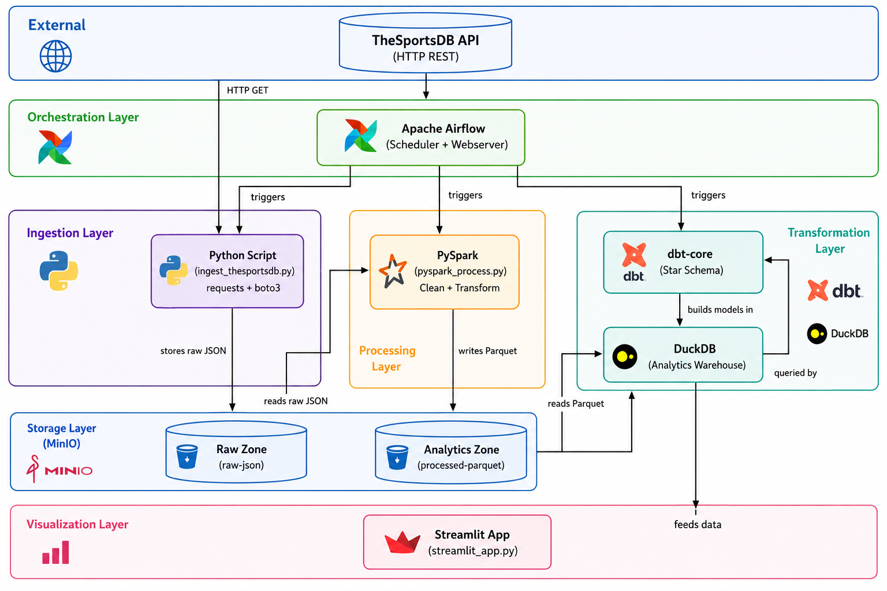

The pipeline runs daily (or on demand) and produces:

- **5 leagues** (BBL, BPL, CPL, Sheffield Shield, Shpageeza)
- **29 teams** (24 international + 5 franchise opponents)
- **28 events/matches** with cricket-specific `win_margin_type` (`runs` /
  `wickets` / `tied` / `no_result`) and `win_margin_value` (integer)

---

## 2. Architecture

### Data flow

```
+----------------+     +----------------+     +-------------------+     +----------------+
|  TheSportsDB   |     |  Python ingest |     |  MinIO raw-zone   |     |  DuckDB +      |
|  REST API      | ──► |  (requests +   | ──► |  cricket/         | ──► |  pyarrow       |
|  (free key 3)  |     |   boto3)       |     |  ├ leagues/       |     |  transform     |
+----------------+     +----------------+     |  ├ teams_by_      |     +--------+-------+
                                             |  │  league/        |              |
                                             |  ├ team_detail/   |              ▼
                                             |  ├ events/        |     +-------------------+
                                             |  └ events_next/   |     | MinIO analytics-  |
                                             +-------------------+     | zone              |
                                                                      | cricket/          |
                                                                      | ├ leagues_clean   |
                                                                      | ├ teams_clean     |
                                                                      | └ events_clean    |
                                                                      +---------+---------+
                                                                                │
                       +-----------------------------------------+              │
                       │  Airflow DAG (6 tasks, daily)            │              │
                       │  ingest → duckdb → dbt deps → dbt run    │              │
                       │  → dbt test → health check               │              │
                       +-----------------------------------------+              │
                                                                                │
                                                                                ▼
                                                                      +-----------------+
                                                                      |  dbt + DuckDB   |
                                                                      |  /tmp/dbt/      |
                                                                      |  duckdb/        |
                                                                      |  sports.duckdb  |
                                                                      |  ┌────────────┐ |
                                                                      |  │ dim_leagues│ |
                                                                      |  │ dim_teams  │ |
                                                                      |  │ dim_dates  │ |
                                                                      |  │ fact_      │ |
                                                                      |  │  matches   │ |
                                                                      |  └────────────┘ |
                                                                      +--------+--------+
                                                                               │
                                                                               ▼
                                                                      +-----------------+
                                                                      |  Streamlit UI   |
                                                                      |  http://        |
                                                                      |  localhost:8501 |
                                                                      +-----------------+
```

### Services (docker-compose)

| Service | Image | Port | Purpose |
|---------|-------|------|---------|
| `etl_minio` | `minio/minio:latest` | 9000, 9001 | S3-compatible object store (raw + analytics zones) |
| `etl_minio_init` | `minio/mc:latest` | — | One-shot bucket creator |
| `etl_postgres` | `postgres:13` | host→5433 | Airflow metadata DB |
| `etl_airflow_init` | custom (DuckDB image) | — | `airflow db init` + admin user |
| `etl_airflow_scheduler` | custom | 8080 (internal) | Schedules DAG tasks |
| `etl_airflow_webserver` | custom | host→8080 | Airflow UI |
| `etl_streamlit` | custom | host→8501 | Cricket analytics dashboard |

---

## 3. Tech Stack

| Layer | Tool | Why |
|-------|------|-----|
| **Source** | [TheSportsDB](https://www.thesportsdb.com/api.php) | Free public sports data API; key=3 works without signup |
| **Ingestion** | Python 3.10 + `requests` + `boto3` | Simple, debuggable, no JVM |
| **Storage** | MinIO | S3-compatible local object store; buckets: `raw-zone`, `analytics-zone` |
| **Transform** | DuckDB (in-memory) + pyarrow | Single-node OLAP engine, fast Parquet I/O, no Spark/Java |
| **Modeling** | dbt-core 1.7 + dbt-duckdb | SQL-based star schema, tests, docs |
| **Orchestration** | Apache Airflow 2.7 | DAG with retries, logging, UI |
| **Visualization** | Streamlit 1.30 | Live charts from DuckDB → Parquet |
| **Containerization** | Docker Compose | One-command stack |
| **Secrets** | `.env` (gitignored) | Local secrets |

---

## 4. Directory Layout

```
ETL_Pipeline/
├── docker/
│   └── Dockerfile.airflow              # Airflow image with DuckDB/dbt/Streamlit
├── dags/
│   └── sports_etl_dag.py               # TheSportsDB end-to-end DAG (6 tasks)
├── scripts/
│   ├── ingest_thesportsdb.py           # API  → MinIO raw-zone (JSON)
│   ├── duckdb_process.py               # raw-zone → analytics-zone (Parquet)
│   └── streamlit_app.py                # analytics-zone → Streamlit dashboard
├── dbt_project/
│   ├── profiles.yml                    # DuckDB + MinIO S3 settings
│   └── sports_analytics/
│       ├── dbt_project.yml
│       ├── packages.yml                # dbt-utils dependency
│       └── models/
│           ├── schema.yml              # Tests + descriptions
│           ├── staging/
│           │   ├── stg_thesportsdb_leagues.sql
│           │   ├── stg_thesportsdb_teams.sql
│           │   └── stg_thesportsdb_events.sql
│           └── marts/
│               ├── dimensions/
│               │   ├── dim_leagues.sql
│               │   ├── dim_teams.sql
│               │   └── dim_dates.sql
│               └── facts/
│                   └── fact_matches.sql
├── docker-compose.yml                 # 5-service stack
├── requirements.txt                    # Pinned Python deps
├── .env                                # Local secrets (gitignored)
├── .env.example
├── README.md                           # This file
└── Documentation & guide/              # Source-of-truth design docs
    ├── PLAN.md
    ├── CODE_BLUEPRINT.md
    └── ARCHITECTURE.md
```

---

## 5. Prerequisites

- **Docker Desktop** (Windows/macOS/Linux) — running, with WSL2 backend on Windows
- **Free ports on host:** `8080` (Airflow), `9000`/`9001` (MinIO), `8501`
  (Streamlit), `5433` (Airflow Postgres; mapped from container's `5432`)
- **TheSportsDB API key** — `3` is the public test key that works without
  signup (already in `.env`). Key `1` currently returns HTTP 400 for all
  endpoints. To get your own key, see https://www.thesportsdb.com/api.php.

> **Note about port 5433:** The Postgres container's internal port is 5432,
> but we map it to host port 5433 so it doesn't clash with any local Postgres
> you may have on your host. Connect from your host with
> `localhost:5433`. From inside the docker network, the service is `postgres:5432`.

---

## 6. Quick Start (Docker — recommended)

```powershell
# 1. Clone / cd into the project
cd C:\Users\adity\Desktop\ETL_Pipeline

# 2. (Optional) Edit .env — defaults are fine
#    Default API key is 3 (free public test key)

# 3. Build and start the stack
docker compose build
docker compose up -d

# 4. Wait ~30-60s for health checks
docker compose ps
# All services should show "healthy" or "Up"
```

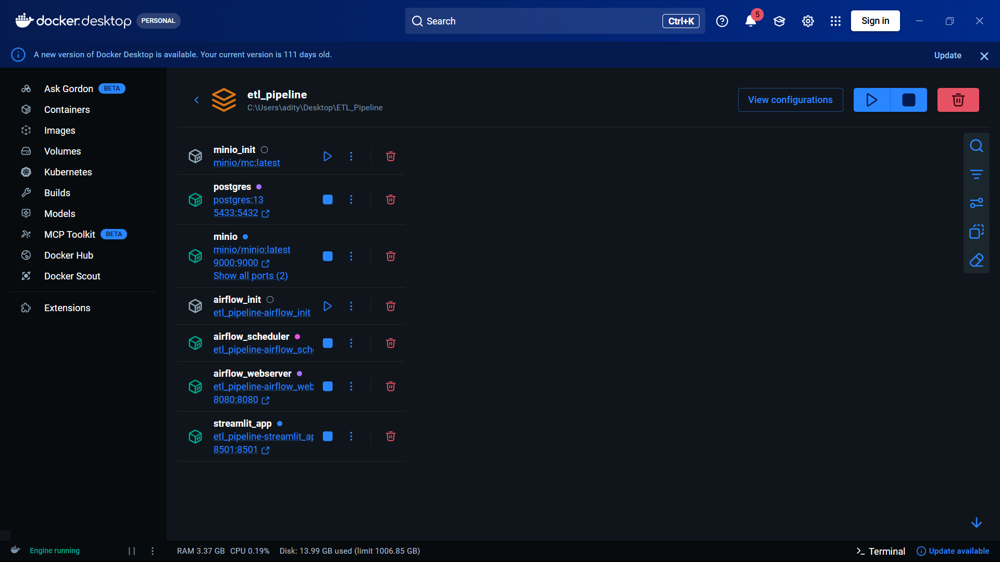

```powershell
# 5. Initialize the Airflow DB (one-time, the init container does this)
docker compose logs airflow_init
# Look for "User already exists" or "Admin: admin" → success

# 6. Open the Airflow UI → http://localhost:8080
#    Login: admin / admin
#    Find DAG: thesportsdb_etl_pipeline
#    Toggle it ON, then click ▶ (Trigger DAG)
```

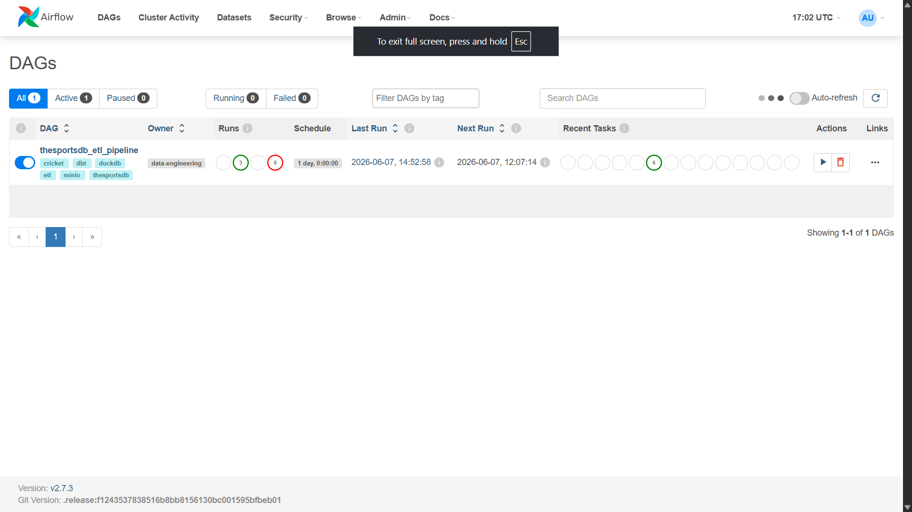

```powershell
# 7. Watch the tasks run (or tail logs):
docker compose logs -f airflow_scheduler
```

The first run takes ~3 minutes (ingest is the longest step at ~80s; everything
else is under 30s). After that, subsequent runs are faster.

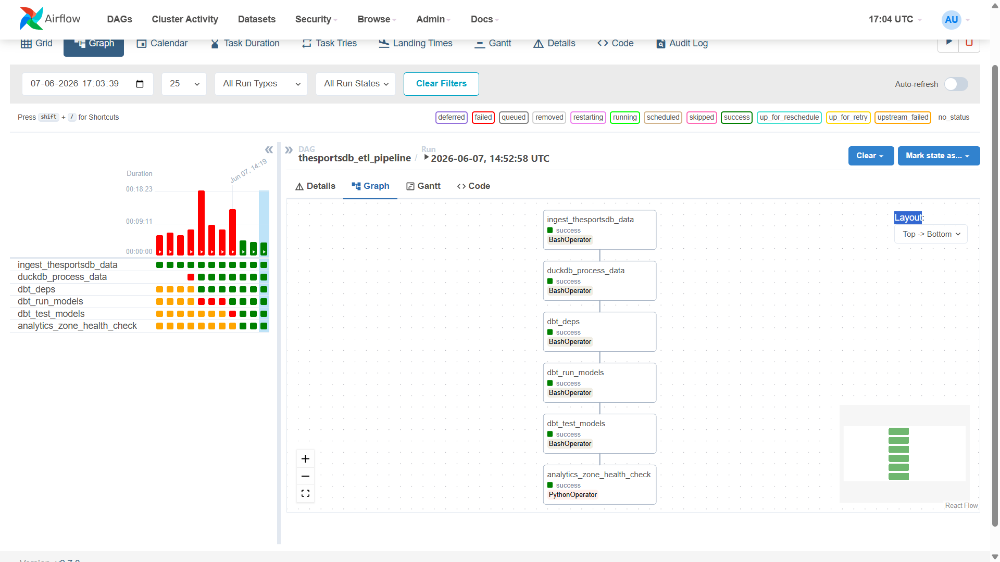

### Stop / clean up

```powershell
docker compose down            # Stop, keep volumes (data persists)
docker compose down -v         # Stop, delete volumes (full clean slate)
```

---

## 7. How to See the Data

Once the DAG has completed successfully, you have **four** ways to inspect
the data:

### A. Streamlit dashboard (easiest)
Open **http://localhost:8501** in your browser. You'll see:

- 4 KPI cards: Leagues / Teams / Matches / Avg Runs per Match
- "Matches by League" bar chart
- "Average Runs per Game by League" chart
- "Win-Margin Type Distribution" (cricket-specific: runs / wickets / no_result / tied)
- "Recent Matches" table (last 20)
- "Team Explorer" with league filter
- "Raw Data Viewer" expander

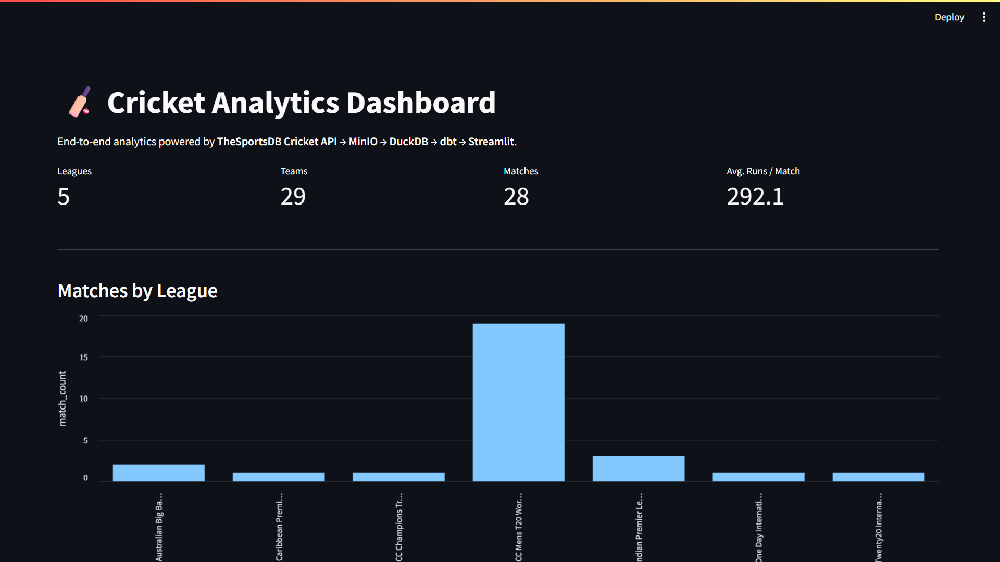

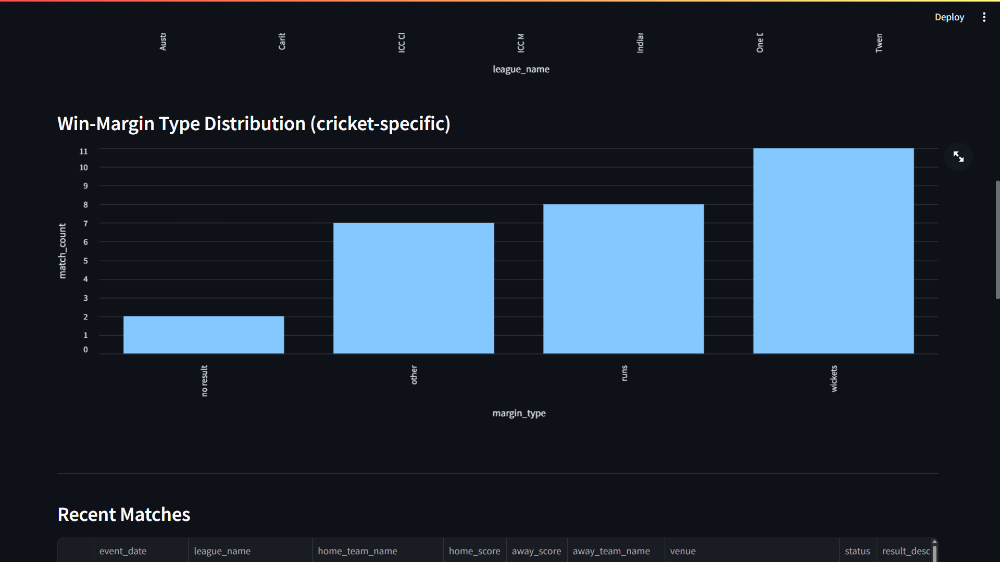

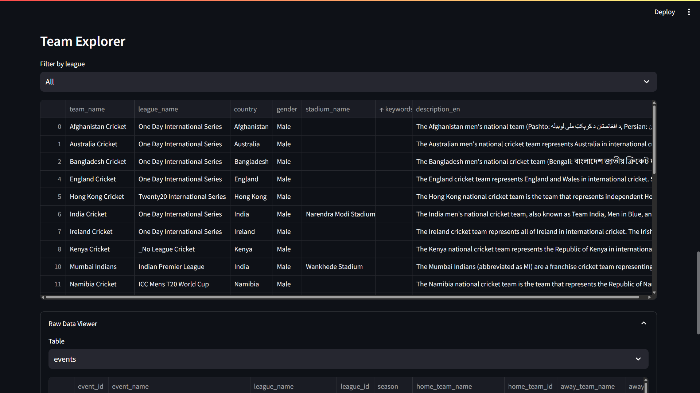

### B. MinIO console (S3 browser)
Open **http://localhost:9001**. Login: `minioadmin` / `minioadmin`.

You'll see two buckets:
- `raw-zone/cricket/` — date-partitioned JSON files
- `analytics-zone/cricket/` — clean Parquet files (`leagues_clean.parquet`,
  `teams_clean.parquet`, `events_clean.parquet`)

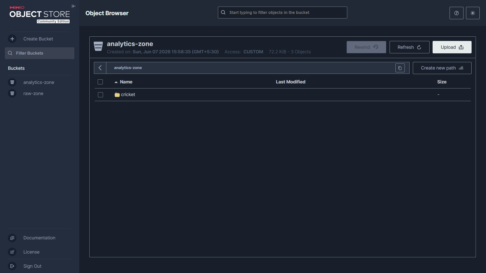

### C. Airflow UI (orchestration logs)
Open **http://localhost:8080**. Login: `admin` / `admin`.

- Click DAG `thesportsdb_etl_pipeline` → Graph view shows the 6-task pipeline
- Click any task → Logs to see detailed execution output
- Browse → DAG Runs to see history

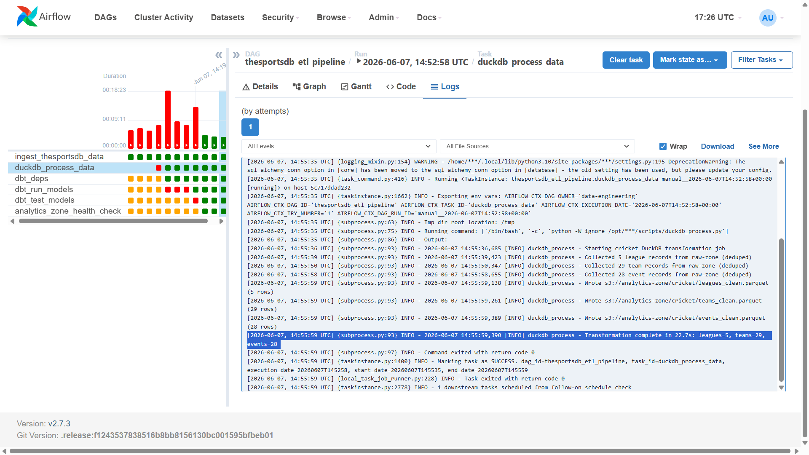

### D. Direct DuckDB query (advanced)
From the Airflow webserver container:

```powershell
docker compose exec airflow_webserver python -c "
import duckdb
con = duckdb.connect('/tmp/dbt/duckdb/sports.duckdb', read_only=True)
con.execute('SET s3_endpoint=''minio:9000''; SET s3_use_ssl=false; SET s3_url_style=''path''; SET s3_access_key_id=''minioadmin''; SET s3_secret_access_key=''minioadmin'';')
con.execute('INSTALL httpfs; LOAD httpfs;')
print(con.execute('SELECT league_name, country FROM dim_leagues').fetchdf())
print(con.execute('SELECT event_name, win_margin_type, win_margin_value FROM fact_matches LIMIT 5').fetchdf())
"
```

---

## 8. Component-by-Component Walkthrough

### 8.1 Ingestion — `scripts/ingest_thesportsdb.py`

**Purpose:** Pull cricket data from TheSportsDB and store raw JSON in
`s3://raw-zone/cricket/`.

**What it does:**
1. Calls `https://www.thesportsdb.com/api/v1/json/3/all_leagues.php` and
   `search_all_leagues.php?s=Cricket` to find cricket leagues
2. For each league in `CRICKET_LEAGUES` (5 hardcoded), calls
   `lookupleague.php?id=<id>` for full metadata
3. For each of 24 international team IDs in `CRICKET_TEAM_IDS`, calls
   `lookupteam.php?id=<id>` for full team details
4. For each of the 24 teams, calls `eventslast.php` and `eventsnext.php`
   for recent and upcoming matches
5. Uploads JSON to MinIO, date-partitioned:
   - `s3://raw-zone/cricket/leagues/YYYY/MM/DD/leagues_TIMESTAMP.json`
   - `s3://raw-zone/cricket/team_detail/<team_slug>/...`
   - `s3://raw-zone/cricket/teams_by_league/<league_slug>/...`
   - `s3://raw-zone/cricket/events/team_<id>/...`
   - `s3://raw-zone/cricket/events_next/team_<id>/...`

**How to customize:**
- Edit `CRICKET_LEAGUES` (line 56) to add/remove leagues
- Edit `CRICKET_TEAM_IDS` (line 64) to add/remove teams
- Edit `RETRY_ATTEMPTS` / `RETRY_BACKOFF` (lines 91-92) for network resilience

**Run standalone:**
```powershell
python scripts/ingest_thesportsdb.py
```

### 8.2 Transformation — `scripts/duckdb_process.py`

**Purpose:** Read raw JSON, normalize, type-cast, derive cricket-specific
columns, write clean Parquet.

**What it does:**
1. Lists all JSON files in `s3://raw-zone/cricket/{leagues,team_detail,teams_by_league,events,events_next}/`

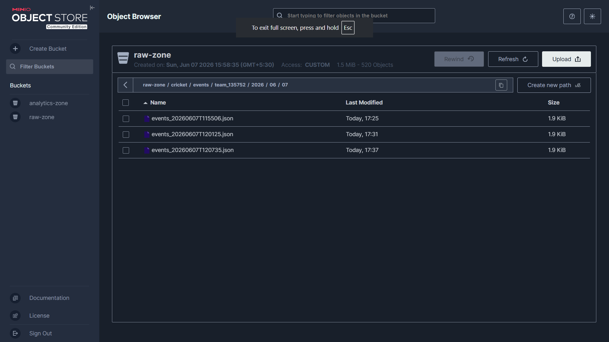

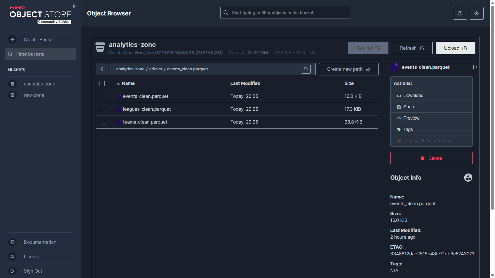
2. Downloads each, parses, dedupes by primary key (league_id / team_id / event_id)
3. Normalizes to a fixed canonical key list (handles missing fields gracefully)
4. Builds an in-memory DuckDB connection, registers each table as a PyArrow table
5. Runs SQL to:
   - Cast types (`INTEGER`, `DATE`, `BIGINT`)
   - Rename to `snake_case` (`idLeague` → `league_id`)
   - Derive cricket columns:
     - `win_margin_type`: `runs` / `wickets` / `tied` / `no_result` / `other`
     - `win_margin_value`: integer from regex `won by (\d+) (runs|wickets)`
     - `winner`: `home` / `away` / `unknown` (substring match)
     - `result_status`: `completed` / `scheduled`
     - `total_runs`: home + away
6. Writes single Snappy-compressed Parquet files:
   - `s3://analytics-zone/cricket/leagues_clean.parquet`
   - `s3://analytics-zone/cricket/teams_clean.parquet`
   - `s3://analytics-zone/cricket/events_clean.parquet`

**Key design decisions:**
- Uses `boto3` + `pyarrow` for Parquet write (more reliable than `COPY ... TO`)
  rather than DuckDB's `httpfs` `COPY` (which has `s3a://` issues)
- Uses `s3://` (not `s3a://`) — dbt-duckdb's httpfs only accepts `s3://`
- Normalizes each dict to a fixed key list before `pa.Table.from_pylist()`
  (handles heterogeneous/missing keys gracefully)

**Run standalone:**
```powershell
python scripts/duckdb_process.py
```

### 8.3 dbt models — `dbt_project/sports_analytics/models/`

**Purpose:** Build a star schema in DuckDB from the clean Parquet.

**Layer 1 — Staging** (`stg_*.sql`):
- Views that read directly from MinIO Parquet via DuckDB `httpfs`
- Light renaming + casting + column selection
- One view per source table (leagues, teams, events)

**Layer 2 — Marts** (`dim_*.sql`, `fact_matches.sql`):
- `dim_leagues` — one row per `league_id`, deduped
- `dim_teams` — one row per `team_id`, deduped; cricket fields:
  `gender`, `stadium_name`, `stadium_location`, `stadium_capacity`,
  `keywords`, `team_badge_url`, `description_en`
- `dim_dates` — one row per calendar day, generated from `stg_events.event_date`
- `fact_matches` — **incremental** on `event_id`; one row per match with all
  cricket-specific columns (`win_margin_type`, `win_margin_value`,
  `total_runs`, `winner`, `result_status`)

**Tests** (`models/schema.yml`):
- `unique` and `not_null` on every primary key
- `accepted_values` on `result_status` ∈ (`completed`, `scheduled`)
- Custom test `dbt_test_models` for duplicate detection

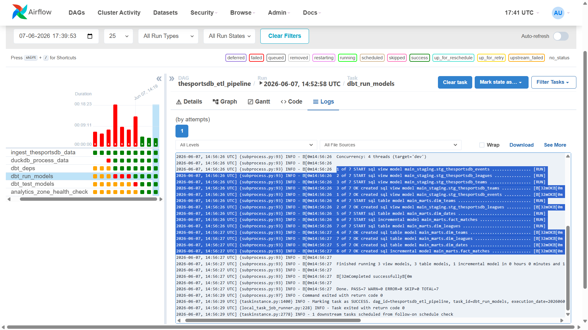

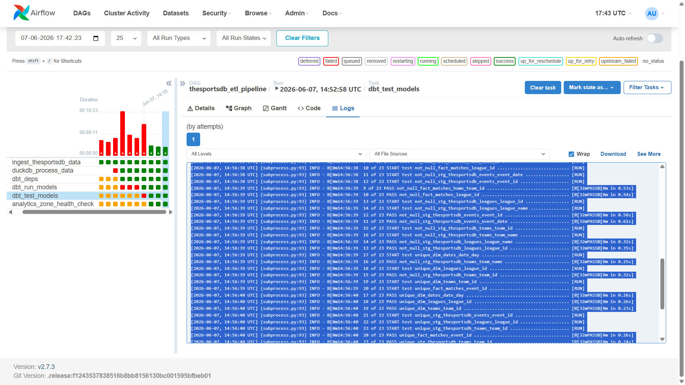

**Run standalone:**
```powershell
cd dbt_project/sports_analytics
dbt deps --profiles-dir ..       # install dbt-utils
dbt run --profiles-dir ..        # build models
dbt test --profiles-dir ..       # run tests (23 total)
```

The output database lives at `/tmp/dbt/duckdb/sports.duckdb` inside the
container.

### 8.4 Airflow DAG — `dags/sports_etl_dag.py`

**DAG id:** `thesportsdb_etl_pipeline`
**Schedule:** `@daily` (`schedule_interval=timedelta(days=1)`)
**Start date:** 2024-01-01
**Catchup:** disabled
**Max active runs:** 1

**Task graph:**

```
ingest_thesportsdb_data  ──►  duckdb_process_data  ──►  dbt_deps  ──►  dbt_run_models  ──►  dbt_test_models  ──►  analytics_zone_health_check
```

| # | Task ID | What it does | Typical duration |
|---|---------|--------------|------------------|
| 1 | `ingest_thesportsdb_data` | Runs `ingest_thesportsdb.py` | ~80s |
| 2 | `duckdb_process_data` | Runs `duckdb_process.py` | ~20s |
| 3 | `dbt_deps` | `dbt deps --profiles-dir /opt/airflow/dbt_project` | ~15s |
| 4 | `dbt_run_models` | `dbt run --profiles-dir /opt/airflow/dbt_project` | ~2s |
| 5 | `dbt_test_models` | `dbt test --profiles-dir /opt/airflow/dbt_project` | ~2s (23 tests) |
| 6 | `analytics_zone_health_check` | PythonOperator that verifies all 3 Parquet files exist | <1s |

**Key env vars** (set on all `BashOperator` tasks):
- `THESPORTSDB_API_KEY=3`
- `MINIO_ROOT_USER`, `MINIO_ROOT_PASSWORD` (from `.env`)
- `MINIO_ENDPOINT=http://minio:9000` (rewritten to internal Docker DNS)
- `S3_ENDPOINT=minio:9000`, `S3_USE_SSL=false`, `S3_URL_STYLE=path`
- `PATH=/home/airflow/.local/bin:/usr/local/bin:/usr/bin:/bin` (so `dbt` is found)
- `HOME=/home/airflow` (so DuckDB's `INSTALL httpfs` can write its extension)

**Trigger manually:**
- Airflow UI: click ▶ on the DAG row
- CLI: `docker compose exec airflow_webserver airflow dags trigger thesportsdb_etl_pipeline`

### 8.5 Streamlit dashboard — `scripts/streamlit_app.py`

**Purpose:** Read Parquet from MinIO via DuckDB and render a cricket UI.

**Components:**
- KPI strip: 4 metrics (Leagues, Teams, Matches, Avg Runs / Match)
- "Matches by League" bar chart
- "Average Runs per Game by League" bar chart
- "Win-Margin Type Distribution" bar chart (cricket-specific)
- "Recent Matches" table (last 20 by `event_date`)
- "Team Explorer" with league dropdown filter
- "Raw Data Viewer" expander with a `st.selectbox` for `leagues`/`teams`/`events`

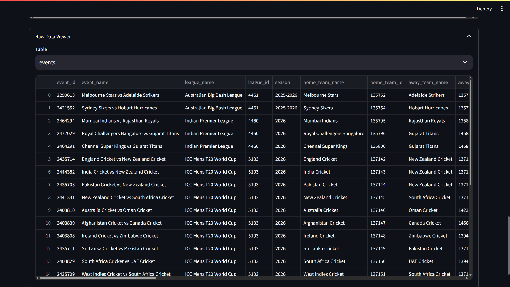

**DuckDB config:**
- Installs `httpfs` extension at startup
- `SET home_directory='/home/airflow';` (so extension install works in the container)
- Sets `s3_endpoint`, `s3_access_key_id`, `s3_secret_access_key`, etc.
- Reads from the **single-file** Parquet paths:
  - `s3://analytics-zone/cricket/leagues_clean.parquet`
  - `s3://analytics-zone/cricket/teams_clean.parquet`
  - `s3://analytics-zone/cricket/events_clean.parquet`

**Caching:**
- `@st.cache_resource` on the DuckDB connection (one connection per session)
- `@st.cache_data(ttl=600)` on `load_table` (10-min cache so refreshes don't hit MinIO)

**Run standalone (outside Docker):**
```powershell
$env:MINIO_ENDPOINT="http://localhost:9000"
streamlit run scripts/streamlit_app.py
```

---

## 9. Data Model (Star Schema)

```
                    +-----------+
                    | dim_dates |
                    +-----+-----+
                          |
                          v
+------------+      +-----------+      +--------------+
| dim_leagues|----->|   fact_   |<-----|  dim_teams   |
+------------+      |  matches  |      +--------------+
                    +-----------+
                        ^   ^
                        |   |
                  home_team_id  away_team_id
```

| Table | Type | Source | Grain | Rows |
|-------|------|--------|-------|------|
| `stg_thesportsdb_leagues` | View | `leagues_clean.parquet` | one row per league | 5 |
| `stg_thesportsdb_teams` | View | `teams_clean.parquet` | one row per team | 29 |
| `stg_thesportsdb_events` | View | `events_clean.parquet` | one row per match | 28 |
| `dim_leagues` | Table | `stg_leagues` | deduped per `league_id` | 5 |
| `dim_teams` | Table | `stg_teams` | deduped per `team_id` | 29 |
| `dim_dates` | Table | generated from `stg_events.event_date` | one row per calendar day | varies |
| `fact_matches` | Incremental | `stg_events` | one row per `event_id` | 28 |

### Key columns in `fact_matches`

| Column | Type | Description |
|--------|------|-------------|
| `event_id` | VARCHAR | PK, from `idEvent` |
| `event_date` | DATE | Match date |
| `home_team_id`, `away_team_id` | VARCHAR | FKs to `dim_teams` |
| `league_id` | VARCHAR | FK to `dim_leagues` |
| `home_score`, `away_score` | INTEGER | Final scores |
| `total_runs` | INTEGER | Sum of both scores |
| `win_margin_type` | VARCHAR | `runs` / `wickets` / `tied` / `no_result` / `other` |
| `win_margin_value` | INTEGER | e.g. `57` for "won by 57 runs" |
| `winner` | VARCHAR | `home` / `away` / `unknown` |
| `result_status` | VARCHAR | `completed` / `scheduled` |
| `venue`, `country`, `city` | VARCHAR | Match location |

---

## 10. Cricket-Specific Logic

The pipeline is tuned for cricket's unique scoring system:

### `win_margin_type` derivation
```sql
CASE
    WHEN strResult IS NULL OR strResult = ''                  THEN 'no_result'
    WHEN strResult ILIKE '%tied%'                              THEN 'tied'
    WHEN strResult ILIKE '%no result%' OR strResult ILIKE '%abandoned%' OR strResult ILIKE '%cancelled%' THEN 'no_result'
    WHEN strResult ILIKE '%won by%runs%'                       THEN 'runs'
    WHEN strResult ILIKE '%won by%wickets%'                    THEN 'wickets'
    ELSE 'other'
END
```

### `win_margin_value` extraction
```sql
CASE
    WHEN strResult ILIKE '%won by%runs%'
        THEN TRY_CAST(REGEXP_EXTRACT(strResult, 'won by ([0-9]+) runs?', 1) AS INTEGER)
    WHEN strResult ILIKE '%won by%wickets%'
        THEN TRY_CAST(REGEXP_EXTRACT(strResult, 'won by ([0-9]+) wickets?', 1) AS INTEGER)
    ELSE NULL
END
```

Examples of values that get parsed correctly:
- `"Stars won by 6 wickets (with 29 balls remaining)"` → `wickets`, `6`
- `"Sixers won by 57 runs"` → `runs`, `57`
- `"Match abandoned without a ball bowled"` → `no_result`, NULL
- `"GT won by 89 runs"` → `runs`, `89`

> **Note:** DuckDB's `LIKE` does **not** treat `[0-9]` as a character class, so
> we use a simple `%runs%` / `%wickets%` substring match, then extract the
> integer with a regex.

### `winner` derivation
Simple substring match of the team name in the result string:
```sql
CASE
    WHEN strHomeTeam IS NOT NULL AND strResult ILIKE '%' || strHomeTeam || '%' THEN 'home'
    WHEN strAwayTeam IS NOT NULL AND strResult ILIKE '%' || strAwayTeam || '%' THEN 'away'
    ELSE 'unknown'
END
```

### Real-world TheSportsDB field names

TheSportsDB uses legacy PascalCase field names. The current code handles the
actual JSON shape:

| TheSportsDB JSON | After DuckDB transform |
|------------------|------------------------|
| `idLeague` | `league_id` |
| `strLeague` | `league_name` |
| `strLeagueAlternate` | `league_alternate_name` |
| `strCountry` | `country` |
| `idTeam` | `team_id` |
| `strTeam` | `team_name` |
| `strTeamAlternate` | `team_alternate` |
| `strStadium` | `stadium_name` |
| `strLocation` | `stadium_location` |
| `strBadge` | `team_badge_url` |
| `intStadiumCapacity` | `stadium_capacity` |
| `strGender` | `gender` |
| `idEvent` | `event_id` |
| `strEvent` | `event_name` |
| `strHomeTeam` / `strAwayTeam` | `home_team_name` / `away_team_name` |
| `intHomeScore` / `intAwayScore` | `home_score` / `away_score` |
| `strResult` | `result_description` |

---

## 11. Common Tasks

### Re-run the entire pipeline
```powershell
docker compose exec airflow_webserver airflow dags trigger thesportsdb_etl_pipeline
```

### Re-run only the dbt models
```powershell
docker compose exec airflow_webserver bash -c "export PATH=/home/airflow/.local/bin:\$PATH && cd /opt/airflow/dbt_project/sports_analytics && dbt run --profiles-dir /opt/airflow/dbt_project"
```

### Inspect a clean Parquet file
```powershell
docker compose exec airflow_webserver python -c "
import duckdb
con = duckdb.connect(':memory:')
con.execute('INSTALL httpfs; LOAD httpfs;')
con.execute(\"SET s3_endpoint='minio:9000'; SET s3_use_ssl=false; SET s3_url_style='path'; SET s3_access_key_id='minioadmin'; SET s3_secret_access_key='minioadmin';\")
print(con.execute('SELECT * FROM read_parquet(\"s3://analytics-zone/cricket/events_clean.parquet\") LIMIT 5').fetchdf())
"
```

### Reset all data and start fresh
```powershell
# Stop, wipe MinIO + Postgres volumes, restart
docker compose down -v
docker compose up -d
docker compose logs -f airflow_init   # wait for "User already exists"
# Then trigger the DAG from the UI
```

### Add a new cricket league
1. Look up the league on https://www.thesportsdb.com (e.g. T20 Blast → id 4480)
2. Edit `scripts/ingest_thesportsdb.py` line 56: add to `CRICKET_LEAGUES`
3. Re-run the DAG

### Add a new team
1. Find the team id (e.g. on TheSportsDB search, look in the URL)
2. Edit `scripts/ingest_thesportsdb.py` line 64: add to `CRICKET_TEAM_IDS`
3. Re-run the DAG

---

## 13. Troubleshooting

### Streamlit shows red errors like `IO Error: No files found`
**Cause:** The Parquet paths in `scripts/streamlit_app.py` don't match what
`duckdb_process.py` writes.
**Fix:** Make sure `load_table()` uses:
- Protocol `s3://` (not `s3a://` — dbt-duckdb's httpfs doesn't accept it)
- Single file paths: `s3://analytics-zone/cricket/<name>_clean.parquet` (not
  `cricket/<name>_parquet/**/*.parquet`)

If you see the data is there but the dashboard says it's empty, check the
streamlit container logs:
```powershell
docker compose logs streamlit_app --tail 50
```

### `IO Error: Could not set HTTPs` or HTTP `400` from TheSportsDB
**Cause:** The API key in `.env` is wrong or has been rate-limited.
**Fix:** Set `THESPORTSDB_API_KEY=3` in `.env` and `docker compose restart
airflow_scheduler airflow_webserver`.

### `HomeDirectoryNotSetException` from DuckDB
**Cause:** DuckDB needs a writable `home_directory` to install the `httpfs`
extension.
**Fix:** Always run `SET home_directory='/home/airflow';` (or wherever the
user's home is) **before** `INSTALL httpfs;`.

### `dbt: command not found` in Airflow logs
**Cause:** `dbt` is at `/home/airflow/.local/bin/dbt` but not in default PATH.
**Fix:** All dbt bash commands in the DAG already export PATH:
```bash
export PATH=/home/airflow/.local/bin:$PATH
```
If you add a new dbt task, do the same.

### `dbt: IO Error: No files found` on staging views
**Cause:** The DuckDB transform didn't run (no Parquet in MinIO) OR the path
in the staging SQL is wrong.
**Fix:** Verify Parquet files exist:
```powershell
docker compose exec airflow_webserver python -c "import boto3; s3=boto3.client('s3', endpoint_url='http://minio:9000', aws_access_key_id='minioadmin', aws_secret_access_key='minioadmin'); print([o['Key'] for o in s3.list_objects_v2(Bucket='analytics-zone').get('Contents', [])])"
```

### Airflow DAG not visible in the UI
**Cause:** DAG file has a syntax error or imports failed.
**Fix:**
```powershell
docker compose logs airflow_scheduler | tail -50
# Look for "Broken DAG" or import errors
docker compose restart airflow_scheduler
```

### `KeyError: "env_var('S3_ENDPOINT', ..."` in dbt
**Cause:** The `schema.yml` has Python-format `external_location` that dbt
doesn't understand. Use `sources: []` and put the path directly in the SQL.

### Port 5432 already in use on host
**Cause:** You have a local Postgres on your host.
**Fix:** Already handled — Postgres is exposed on host port **5433**, not
5432. Connect from host: `localhost:5433`.

### All tasks pass but dashboard is empty
**Cause:** Streamlit cached an old (empty) version, OR its DuckDB connection
failed silently.
**Fix:**
1. Hard-refresh the dashboard (Ctrl+Shift+R)
2. Check the streamlit container logs for the actual `Error reading X:` line
3. `docker compose restart streamlit_app`

---

## License

MIT — feel free to recommend changes if needed
